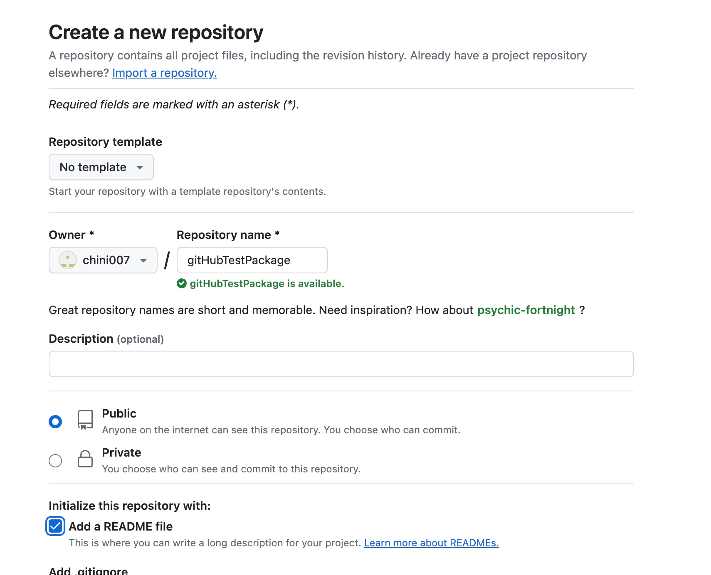
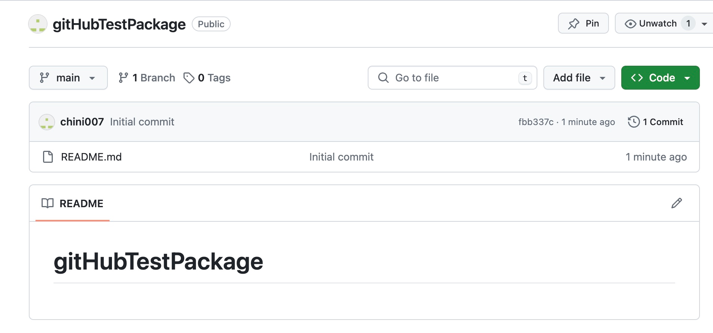
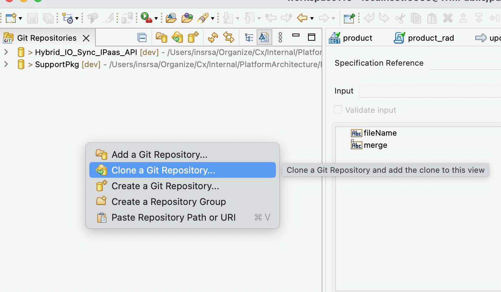
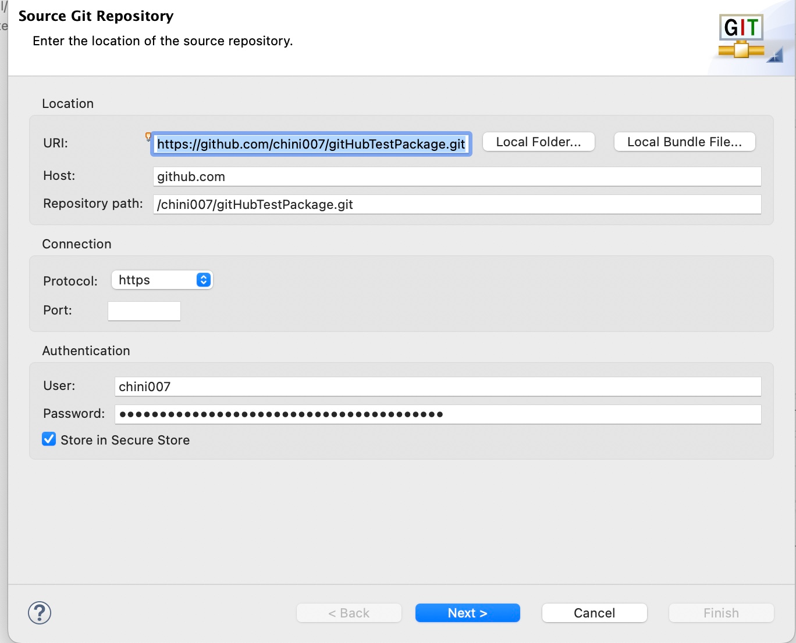
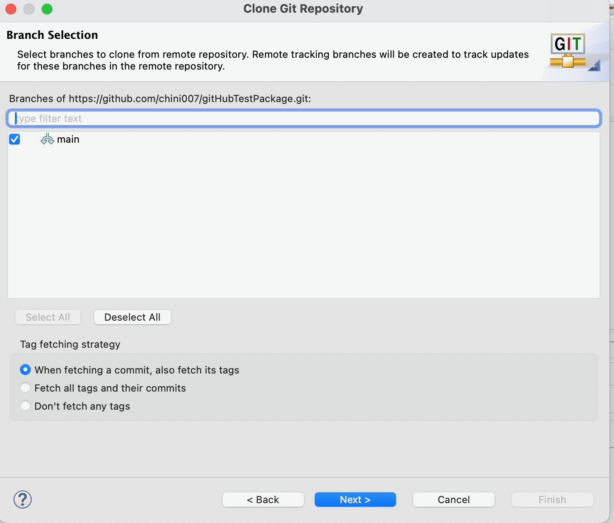
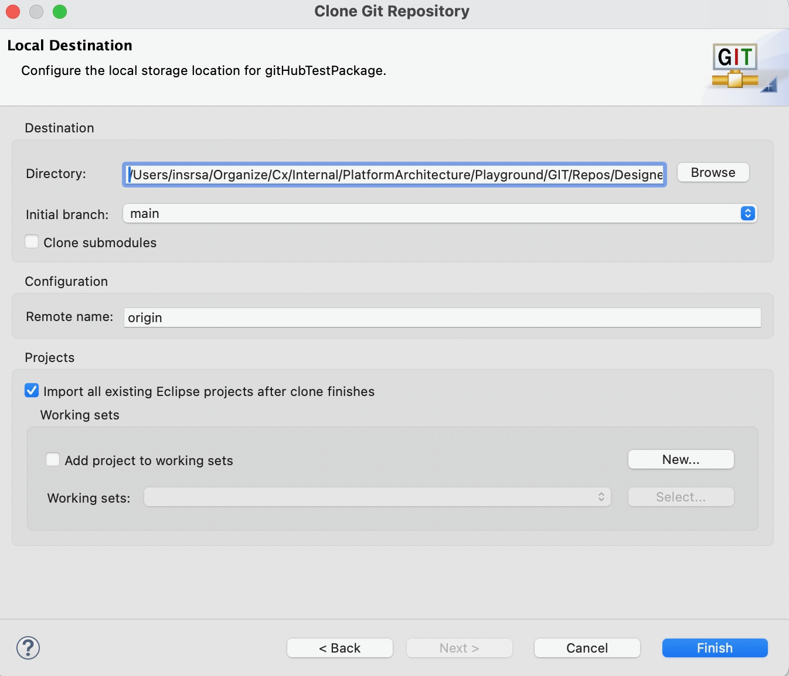
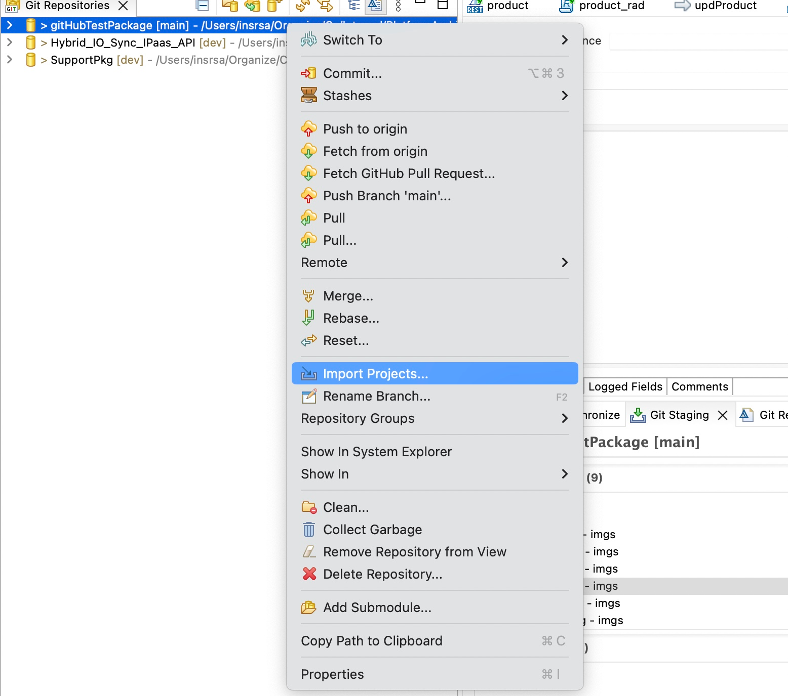
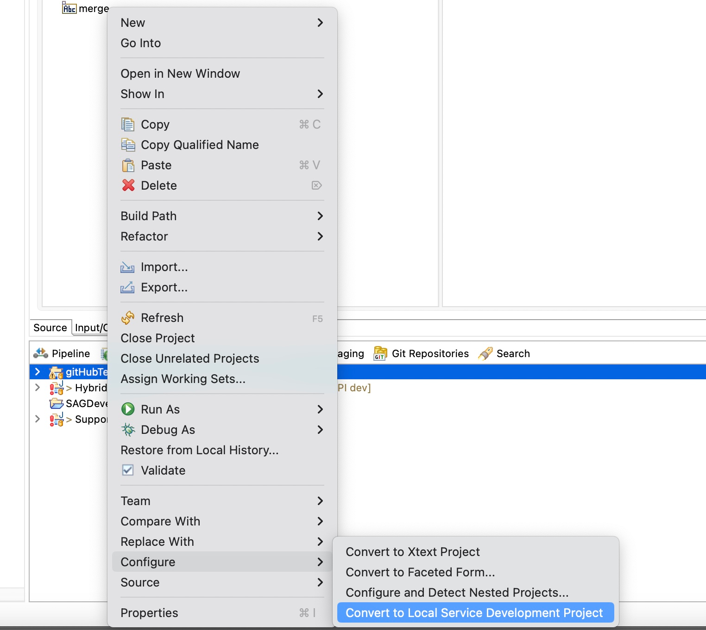
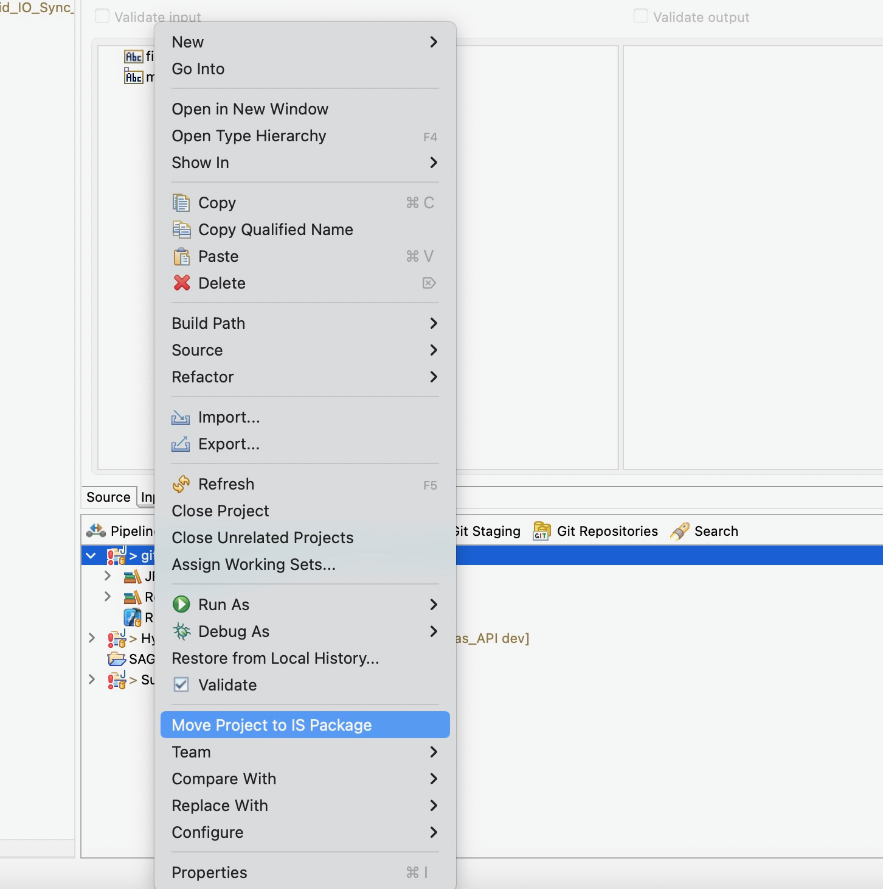

# Gitrepo for Package linked at root level

## Create a repo

1. 
   

2. 
   

## Designer

### Clone the repo

1. Right click on "Git" perspective
   

2. Provide URL, Credentials
   

3. Select the branch
   

4. Selected the (mounted) directory
   

### Import the cloned package

1. Right click the cloned repo and then select Import Project
   

### Convert to Local Development Service Project

1. Switch to "Service Development Perspective", then from Package Explorer view, right click on the imported project > configure > Covert to "Local Service Development Project"
   

### Move Project to IS Package

1. Right click select "Move Project to IS Package"
   